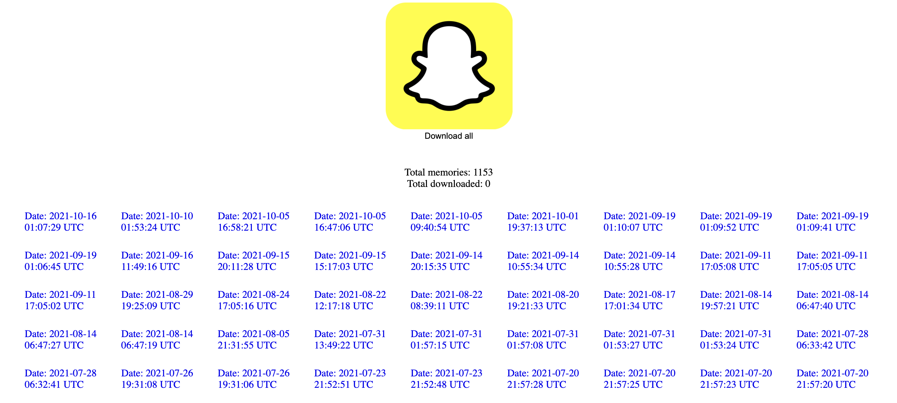

## Snapchat memory downloader 👻

**Motivations behind this projects**

In wanting to back up all my data on my hard drive I also wanted to preserve all my Snapchat memories. But since Snapchat makes it so hard to download everything all at once, I wanted to write a program with a simple interface that could do this for me.

**How to use:**

 - Fork this project
 - Go to https://accounts.snapchat.com/ and log in
 - Under "My Data", click "Submit request" to recieve a download link (this data will only be available for 7 days)
 - In the folder you receive go to json > memories_history.json
 - Place that file into the directory of this project
 - Open up the index.html file on a local web server
 - Make sure the browser allows for multiple automatic downloads
 - To abort, simply refresh the site

 **Future updates:**
 - Download memories in chronological order
    - Snapchat makes this extra difficult, even though the data includes date stamps
 - Automatically set up a web browser
     - Currently, the fetch request doesn't work if you just open the HTML file in the browser